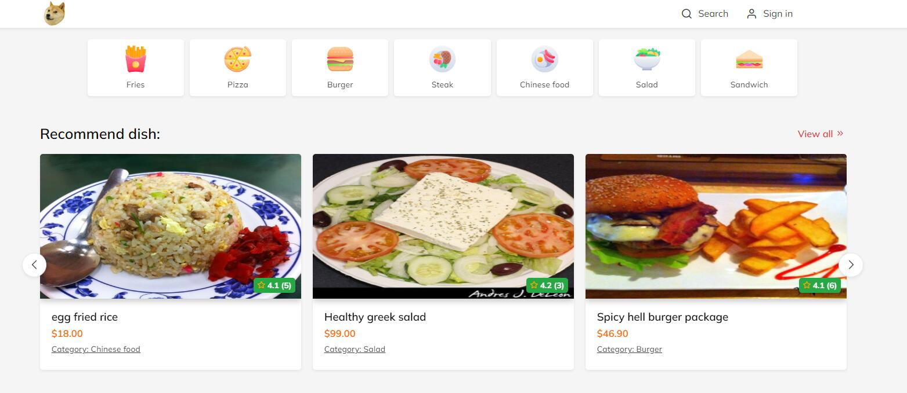
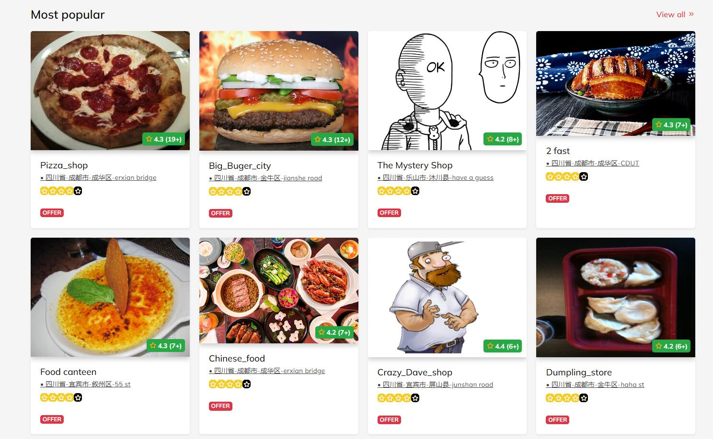
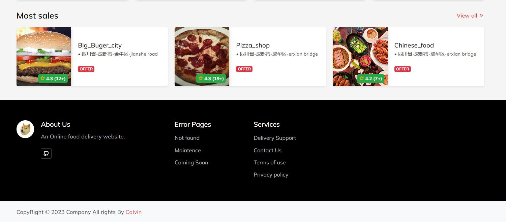

# Online food delivery website with Recommendation system
## General introduction:  
> This is an intelligence recommendation system for online food ordering platform based on a **hybrid recommendation system** (use **Collaborative Filtering** and **Content-based recommendation**).  

- **User type**:
1. customer
2. merchant
3. administrator

---
 
## 🚀Environment:  
- Language: python (3.9) (Version >=3.7)   
- Database: mysql  
- Framework: django (4.2)  

**third-party library:**  
- PyMySql 1.1.0  
- numpy 1.26.4  
- pandas 2.2.1  
- scikit-learn 1.4.1  
- Bootstrap 3  
- Feather icon  
- Jquery  

----

## 📜Hybrid Recommendation system:
> This project combines two different recommendation algorithms in terms of weights.  
### Collaborative Filtering:  
- User-CF:  
> we use ***Adjusted Cosine Similarity (John.S.Breese)*** to calculate the similarity between user, and store it in *user similarity matrix*.   

### Content-based recommendation:  
> Using  ***Jaccard index*** to measure the similarity of item.  

In addition, we also create a **popularity-based recommendation function** to recommend items based only on the data of the item itself (such as sales and number of favorites), which solves the ***cold start*** problem of the above two recommendation algorithms.  

---

## 💻Deploy & Run project:

### 1. connect with database:
- Use the database sql file `onlinefooddelivery.sql`
- Config the mysql in `setting.py`

- Perform database migrations
```
python manage.py makemigrations

python manage.py migrate
``` 

### 2. - How to run this project?  
`python manage.py runserver`  
url: `http://127.0.0.1:8000/`  

---

### Administrator:  
- How to access the admin page?  
`http://127.0.0.1:8000/admin`  

- How to create an admin account?  
`python  manage.py createsuperuser `  
 

--- 

### View of website:
- Index page (not log in)



